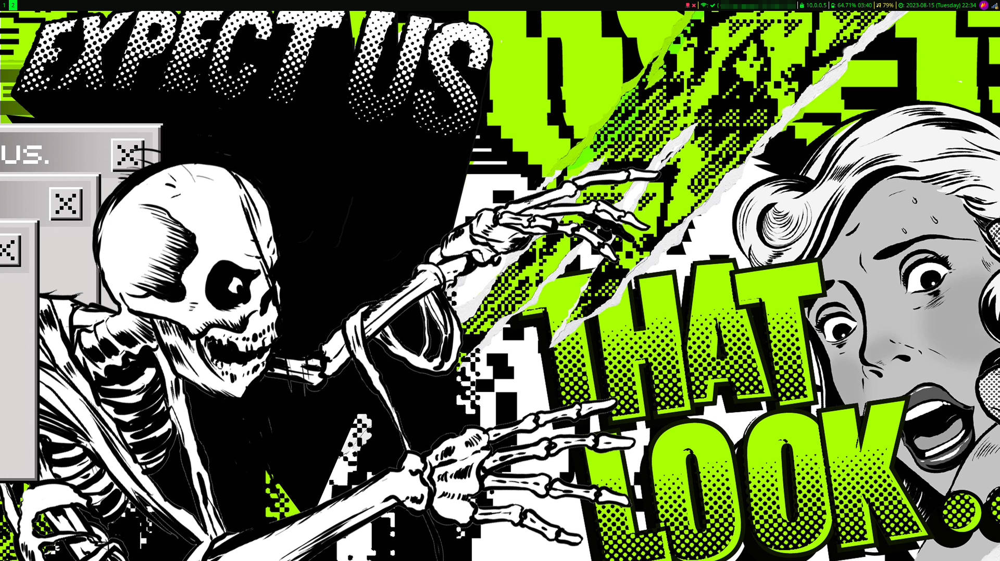
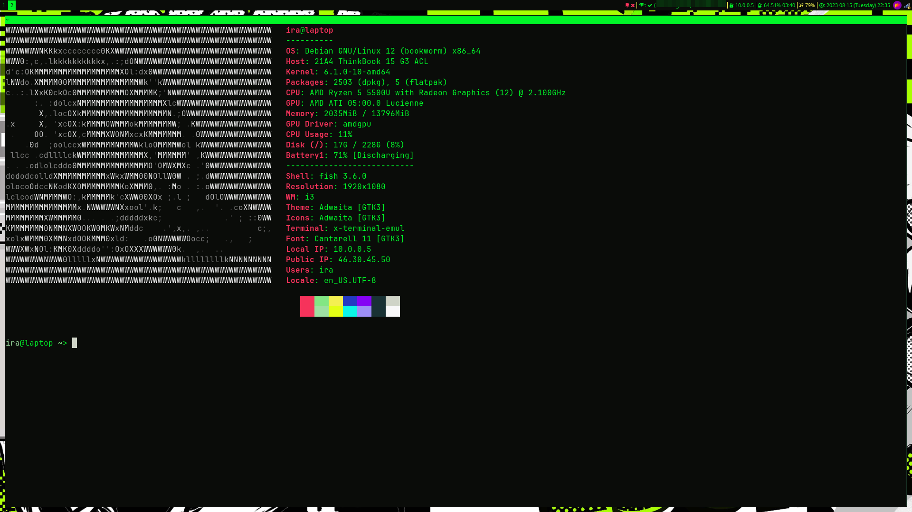
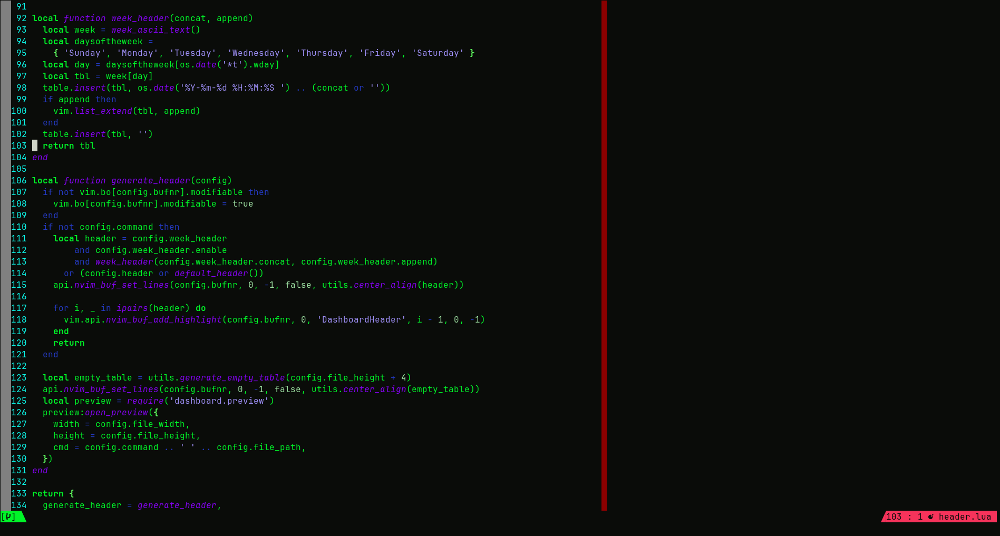
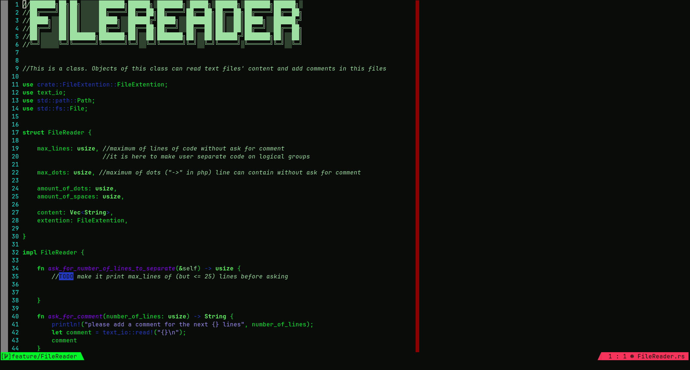

# Dedsec

This is a pack of configuration files for i3, alacritty and neovim

## How it looks on configured machine

## Colors
The design of the configuration is inspired by watch Dogs 2

colors i used:
| hex       | xterm     | color                                                    |
|-----------|-----------|----------------------------------------------------------|
| #0A0C09   | 0         |  |
| #82E684   | 114       |  |
| #9EE0A2   | 151       |  |
| #CFD4C7   | 188       |  |
| #193234   | 22        |  |
| #00F528   | 10        |  |
| #9E8FF6   | 141       |  |
| #8502F4   | 93        |  |
| #243AC3   | 26        |  |
| #0CF5E7   | 50        |  |
| #E3FF14   | 190       |  |
| #F6335B   | 203       |  |
| #F78FB4   | 211       |  |
| #F5CE89   | 222       |  |
| #F4F051   | 227       |  |
| #F9F9F9   | 15        |  |
| #F227F5   | 201       |  |

color palette was made by https://vk.com/mushroomchips

## Instalation

### Alacritty

1. Install alacritty
2. Do `mv alacritty.yml $HOME/.alacritty.yml`
3. Done!

### i3wm

1. Install i3-gaps
2. Do `mv i3/config $HOME/.config/i3/config`
3. Do `mv i3status/config $HOME/.config/i3status/config`
4. Done!

### Neofetch

1. Install neofetch
2. Do `mv neofetch/* $HOME/.config/neofetch/`
3. Use `neofetch --source /path/to/file` or set alias

### Neovim

There are such options as use text highliting scheme only or use complete configuration with lsp support, custom dashboard and statusline

#### highliting shceme only

1. Install neovim
2. Do `mkdir $HOME/.config/nvim/colors/`
3. Do `mv vimcolors/dedsec.vim $HOME/.config/nvim/colors`
4. Add `vim.cmd("colorscheme dedsec")` if you use lua or `colorscheme dedsec` if you use vimscript
5. Done!

#### Complete config

1. Install neovim
2. Do `git clone --depth 1 https://github.com/wbthomason/packer.nvim ~/.local/share/nvim/site/pack/packer/start/packer.nvim`
3. Do `mv nvim/* $HOME/.config/nvim/`
4. Run `nvim` and do `PackerSync`
5. Choose to not remove packer
6. Done!
